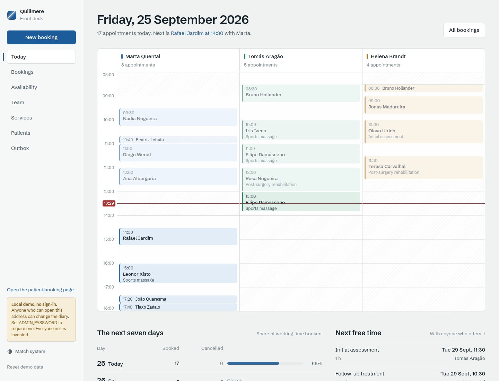
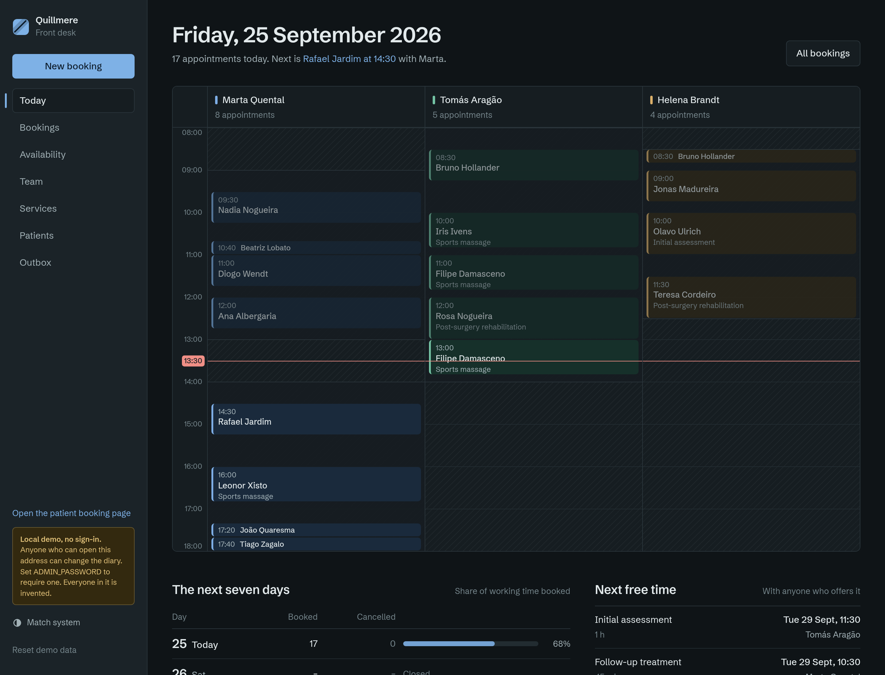
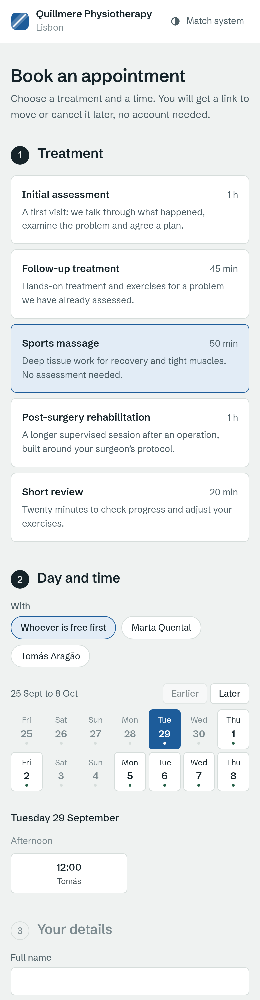
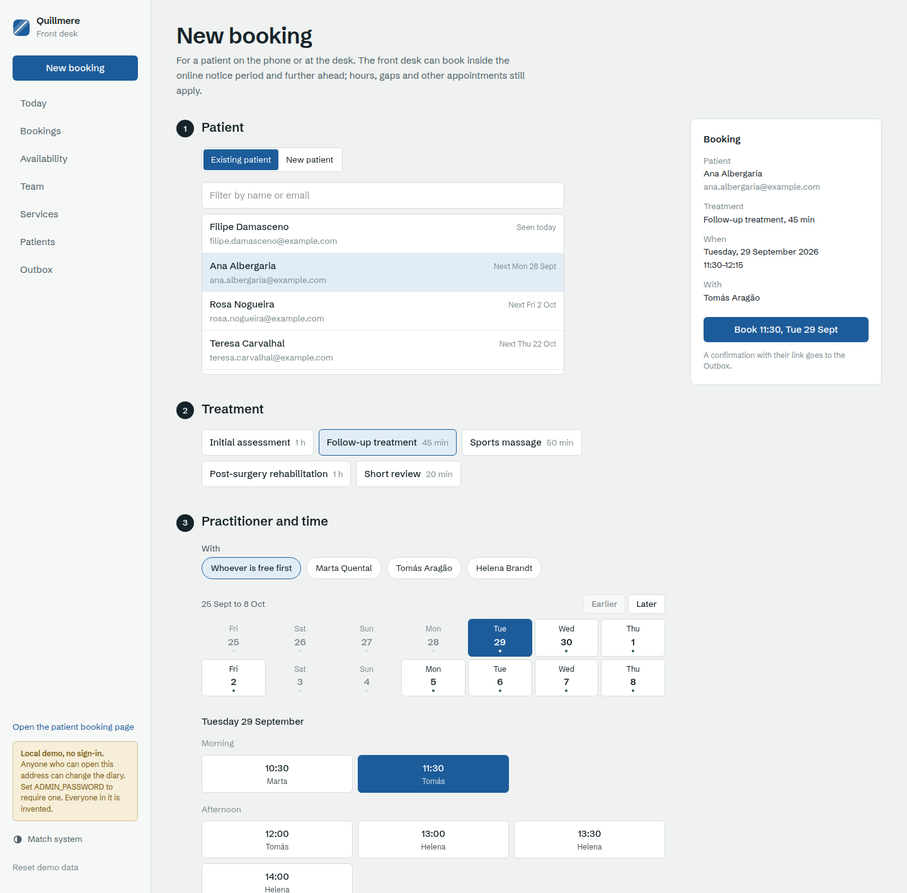
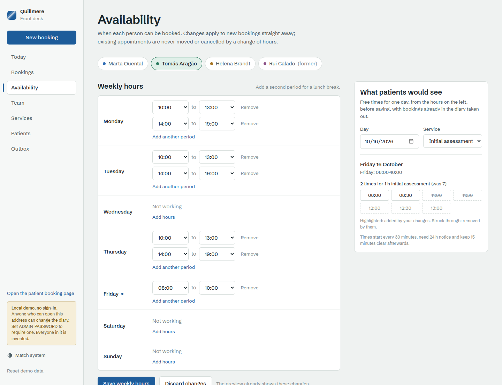
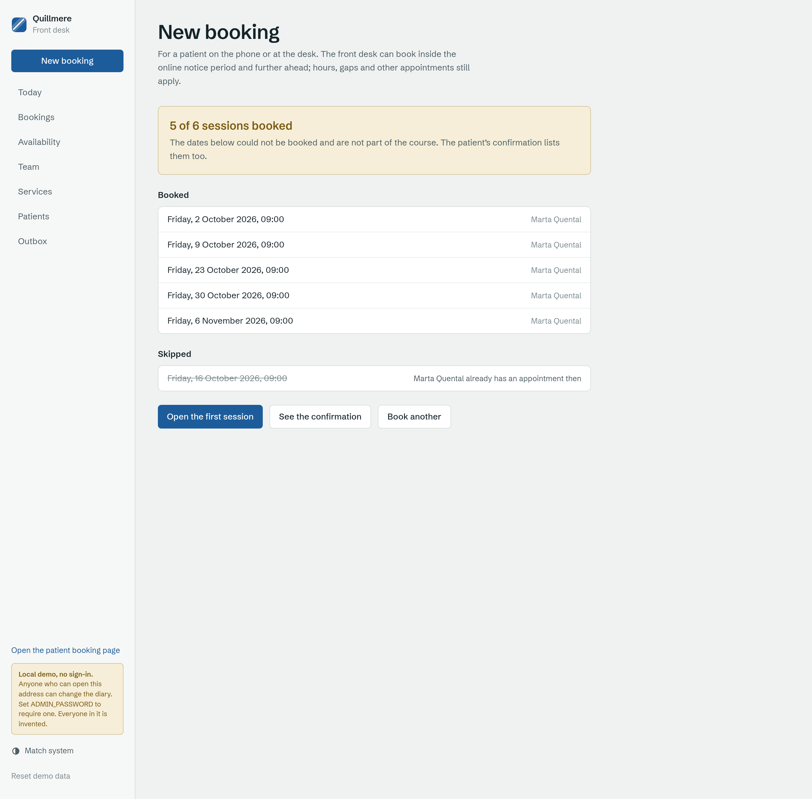
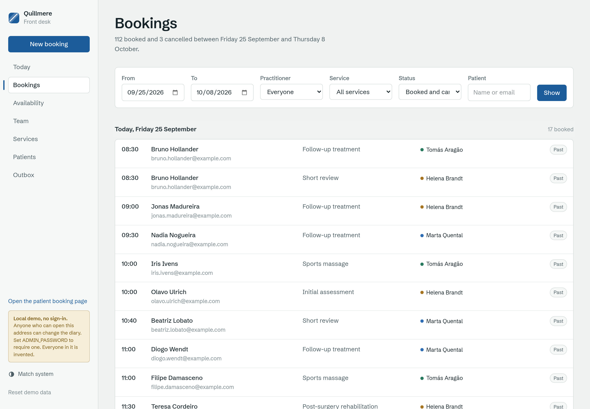
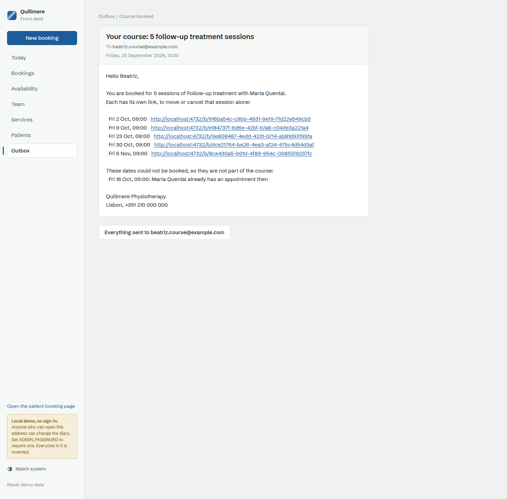
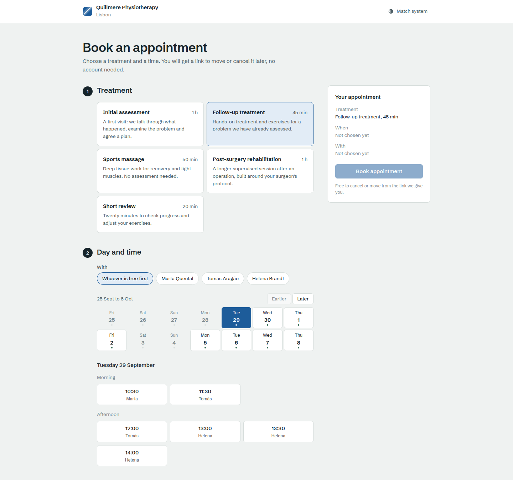
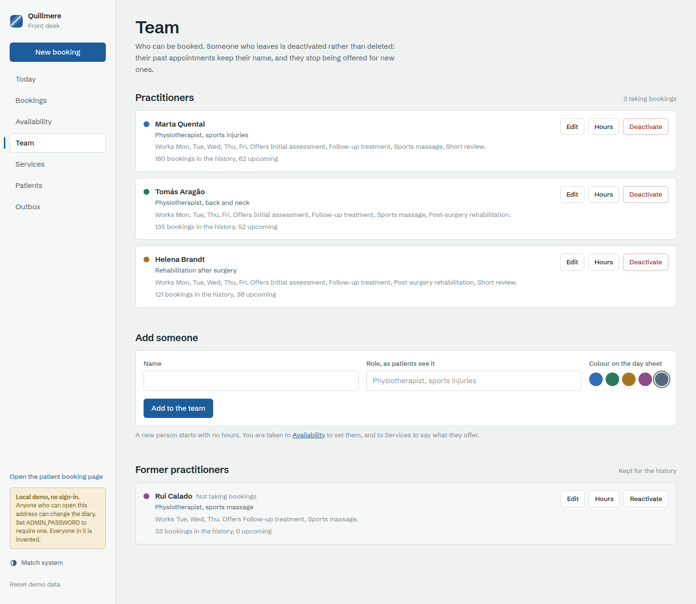

# clinic-booking-app

[](https://github.com/eranoix/clinic-booking-app/actions/workflows/ci.yml) [](LICENSE)   

**Online booking for a clinic, with a page for patients and a front desk for staff.**

*In plain words:* Booking an appointment by phone takes time for both the patient and the clinic. This app lets patients pick a free time online and get a link to change or cancel it later, with no account to create. Staff get a front desk screen to see the day, set working hours and handle bookings. The system makes sure two people can never book the same time slot.

Availability rules, recurrence and conflict-free booking, with reschedule and
cancel links that work without an account. And a clinic's booking site built
on it, to show what that means for the people using it.

<p align="center"> </p>

## Run it

Three ways, from a fresh clone.

**1. One command, with Node 22.12 or later.**

```bash
npm run app
```

It installs whatever is missing, builds the engine and the site, and starts
it on <http://127.0.0.1:3000>: the booking page at `/book`, the front desk at
`/admin`. If 3000 is taken it uses the next free port and says which.

**2. Docker, with no Node on the host.**

```bash
docker compose up --build
```

Same site on <http://localhost:3000>. The image compiles the SQLite driver
inside itself, and the database lives on the `clinic-data` volume, so it
survives restarts; `docker compose down -v` deletes it.

**3. Just the engine, as a library.**

```bash
npm install
npm run demo
```

```
Open slots, week of 2 March: 12
  first: Mon 02 Mar, 09:00
  last:  Sat 07 Mar, 12:00
  Wed 4 Mar is closed: true
  Sat 7 Mar opened for one week: true

Booked Mon 02 Mar, 09:00 — link token d83127b2…
Second attempt refused: that time was just taken

Course of treatment — Every week on Mon, 4 times
  booked   Mon 09 Mar, 14:00
  booked   Mon 16 Mar, 14:00
  booked   Mon 23 Mar, 14:00
  booked   Mon 30 Mar, 14:00

Rescheduled to Mon 02 Mar, 11:00; link token unchanged: true
Cancelled. Slot free again: true
Record kept rather than deleted: cancelled
```

The token is new on every run; everything else is reproducible.

### Settings, sign-in and starting over

Copy [`.env.example`](.env.example) to `.env`; every way of running reads it,
and every variable is optional.

- **No `ADMIN_PASSWORD`** (the default): the front desk has no sign-in, and
  says so on every page. That is fine on your own machine and nowhere else;
  both ways of running listen on loopback only for that reason.
- **`ADMIN_PASSWORD` set**: `/admin` and the admin API ask for it. Signing in
  sets a signed, HttpOnly session cookie for 12 hours; the password is
  compared in constant time; "Sign out" clears it. Changing the password, or
  `SESSION_SECRET`, signs everyone out.

The first request creates the database and fills it with a few weeks of
invented bookings either side of today. To throw your changes away and start
again: **Reset demo data** in the front desk's sidebar, `npm run reset` at the
repository root, or, under Docker, `docker compose down -v`.

Do not put it on the public internet as it is. Even with a password, it is a
demo: one shared password, no accounts, no rate limiting on sign-in beyond a
fixed delay.

## What you can do with it

[`web/`](web/) is a Next.js site for Quillmere Physiotherapy, an invented
clinic in Lisbon: three practitioners, a fourth who has left, five treatments
and some fifty patients, all with `@example.com` addresses. Both sides go
through the engine for every time they show and every booking they take.

**As a patient**, open `/book`: pick a treatment, see the next two weeks with
the days that have room marked, pick a time, give a name and an email. You get
a link, and that link is the whole account: from it you can move the
appointment to another time the diary really has free, or cancel it. If
someone else takes the time while you are typing, the page says exactly that
and offers the three closest times still free.

The site sends no email. Every confirmation, move and cancellation is written
to an **outbox** instead, in the same database transaction as the change it
describes, so a message exists exactly when the change committed. The
confirmation screen links to the email you would have received, with the
manage link in it, and the front desk's **Outbox** lists every message. The
"you get a link" promise can be followed end to end.

**At the front desk**, open `/admin`:

- **Today** is the day sheet: a column per practitioner, appointments where
  they fall, time nobody is working hatched out, a line for now. Below it,
  the week ahead and the first free time for each treatment.
- **New booking** books a patient on the phone: an existing patient or a new
  one, a treatment, a practitioner or whoever is free first, then only the
  times the engine offers. The desk may book inside the online notice period;
  hours, gaps and other appointments still apply, and losing a race reads the
  same as on `/book`. It can book a **course** instead (weekly for six weeks,
  say) and shows which dates were booked and, for the ones that could not
  be, why.
- **Bookings** finds anything by date, practitioner, service, status or
  patient. A booking can be moved to another time *or another practitioner*
  in one step, cancelled, or, for a course, cancelled from that session on.
- **Availability** edits each practitioner's weekly hours, days away and
  one-off open days. A preview shows the times patients would be offered on
  any day, with what the unsaved change adds and removes marked. It is not an
  imitation of the rules: it is the engine's own `slots()`, the function
  `book()` checks against, running in the browser. Changing hours never
  cancels anyone; the page lists the appointments now outside them.
- **Team** and **Services** add, rename and edit practitioners and treatments.
  One with bookings is deactivated, never deleted, and the page says why: its
  history keeps its name, and it stops being offered. One with no bookings at
  all can be removed.
- **Patients** lists everyone who has booked, and each person's history.

| Booking, on a phone | New booking |
|---|---|
| <picture><source media="(prefers-color-scheme: dark)" srcset="docs/screenshots/booking-page-phone-dark.png"></picture> | <picture><source media="(prefers-color-scheme: dark)" srcset="docs/screenshots/new-booking-dark.png"></picture> |
| **Hours, with an unsaved change previewed** | **A course, with a skipped date explained** |
| <picture><source media="(prefers-color-scheme: dark)" srcset="docs/screenshots/availability-dark.png"></picture> | <picture><source media="(prefers-color-scheme: dark)" srcset="docs/screenshots/course-result-dark.png"></picture> |
| **Bookings** | **Outbox** |
| <picture><source media="(prefers-color-scheme: dark)" srcset="docs/screenshots/bookings-dark.png"></picture> | <picture><source media="(prefers-color-scheme: dark)" srcset="docs/screenshots/outbox-message-dark.png"></picture> |
| **Booking, as a patient** | **Team** |
| <picture><source media="(prefers-color-scheme: dark)" srcset="docs/screenshots/booking-page-dark.png"></picture> | <picture><source media="(prefers-color-scheme: dark)" srcset="docs/screenshots/team-dark.png"></picture> |

`node web/scripts/smoke.mjs http://127.0.0.1:3000` walks all of it against a
running server: the patient's flow, a front-desk booking, a move to another
practitioner, a course and its cancellation, the Outbox, and sign-in when you
pass `--password`. CI runs it with sign-in off and on, and runs the Docker
image too.

### How the site uses the engine

`web/` depends on this package as `"clinic-booking-app": "file:.."`, installed
as a copy rather than a symlink (`install-links=true` in `web/.npmrc`). A
copy sits under `web/node_modules` like any published package, which is what
lets Next.js keep the engine and its native SQLite driver out of the bundle
and load them with Node, the way the tests do. `npm run dev` and
`npm run build` in `web/` rebuild the engine and refresh that copy first
(`web/scripts/sync-engine.mjs`), so an edit in `src/` shows up without a
reinstall. Browser code imports only `clinic-booking-app/availability`, the
pure slot arithmetic, which has no database in it.

Staff, weekly hours, date exceptions and services live in the web app
(`web/src/server/catalog.ts`), in the same SQLite file as the bookings. The
engine takes rules as values on every call, which is what keeps it testable
without fixtures and usable with rules kept anywhere; a services table in the
engine would also have to decide what a service *is* to a business, which is a
product question. The engine keeps what must be written in the same
transaction as the conflict check: the booking, and the outbox message about
it. What the message *says* is the site's (`web/src/server/mail.ts`); that it
is written atomically with the change is the engine's. Patients have no table
at all: booking needs no account, so the booking row is the only place a
patient is ever written, and the engine derives the list from it.

---

## Why this is harder than a loop over opening hours

The naive version subtracts bookings from opening hours. It falls apart on the
cases that make up most of real scheduling, and each one here is a test:

**The gap between appointments is a rule, not rounding.** A 50-minute service
offered on a 60-minute grid leaves ten minutes by construction, rather than by
asking staff to remember.

**Exceptions add availability as well as remove it.** Opening one Saturday and
closing one Wednesday are the same shape of data. Modelling only the closure
means the opening gets hacked in later, somewhere else.

**The time kept free after an appointment belongs to that appointment.** Each
booking stores the end of its buffer and holds it against everyone else, so a
ten-minute tidy-up after a massage is protected whichever booking was made
first. Holding it only on the slot being offered makes the gap depend on
booking order, and a check that only `available()` applies is one a direct
`book()` call walks straight past.

**Touching is not overlapping.** An appointment ending at 10:00 and one
starting at 10:00 do not collide. Treating that as a clash loses one slot per
boundary, every day, and the loss is invisible.

**Days are not always 24 hours long.** A weekly series across a daylight-saving
boundary must keep landing at 09:00 local. Adding `7 × 86_400_000` lands it an
hour out, and nobody finds out until someone misses an appointment. Expansion
walks the local calendar; wall-clock times are resolved against a named zone
and never carried inward as a stored offset.

**The 31st of a 30-day month is skipped, not clamped.** Moving it to the 30th
invents an occurrence the person never asked for, and it shows up as a stranger
in their calendar.

## The race that matters

Offering a slot and taking it are separated by however long someone spends
deciding. Two people can both be told the same slot is free, because it was
when they asked.

So **availability is advice and the write is the authority.** The conflict check
runs inside the same transaction as the insert, re-reading what is booked
rather than trusting what was offered. Checking in application code that ran a
moment earlier and inserting after it is the classic double-booking bug, and it
appears only under the load that makes it expensive. Where the check runs
matters less than when: inside the transaction, nothing can commit between the
read and the insert.

Every write transaction starts `IMMEDIATE`: it takes SQLite's write lock
before it reads, so a second connection (another server process on the same
file) waits instead of committing between our check and our write. The tests
open two engines on one file and make the second one lose.

Two collisions need two mechanisms. A partial overlap (09:00 to 09:50 against
one starting at 09:30) is the explicit overlap check over the rows re-read
inside the transaction. A second booking starting at the same instant is also
refused by a partial unique index on `(resource_id, starts_at)` limited to
confirmed rows: enforced by the database itself, so it holds even against a
writer that goes around the engine, and it is the shape the Postgres port keeps.

A reschedule is one transaction too, and one row: the same checks run, and then
the start and end are updated in place. Nothing is cancelled and re-inserted, so
there is no moment when the old appointment is gone and the new one has not
landed: a move that cannot land leaves the original exactly as it was. Done as
two calls, that moment exists, and a failure inside it leaves someone with
nothing.

That holds for a move to **another resource** as well: a different
practitioner, a different room. The resource is a column of the same row, so
the move is the same single `UPDATE`, checked against the new resource's
calendar and bookings. At no instant does the appointment exist twice, or not
at all; it cannot be doubled by a crash halfway, because there is no halfway.

## Messages that cannot disagree with the diary

A confirmation sent for a booking that then rolled back is wrong; a booking
whose confirmation was lost because the mail server was down is wrong the other
way. Sending from the request handler gets one of those eventually.

So the engine has a **transactional outbox**. Give it a composer and every
change (booked, moved, cancelled, a course booked, the rest of a course
cancelled) calls it inside the transaction that makes the change, and writes
what it returns to an `outbox` table in that same transaction. A message
exists exactly when its change committed. If the composer throws, the change
rolls back with it. Delivering the messages is someone else's job, reading the
table; the site in `web/` shows them instead of sending them.

A course is booked in one transaction with a savepoint per session: a session
that cannot land rolls back alone, the rest commit together, and the patient
gets one message listing both what was booked and what was not.

## Links without accounts

Every booking carries an unguessable token, separate from its row id. A
sequential id in a URL lets anyone enumerate other people's appointments, and
the link has to work without a login because the person booking may not have an
account. Rescheduling preserves the token, so the link already sitting in their
inbox keeps working.

Cancelled bookings are marked, not deleted. *Was there ever an appointment?* is
a question people ask precisely when something has gone wrong.

## Using it

```ts
import { SchedulingEngine, SlotUnavailable, expand, type Calendar } from 'clinic-booking-app';

const engine = new SchedulingEngine({
  path: './bookings.db',
  // Optional. Runs inside each change's transaction; what it returns is
  // written to the outbox table in that same transaction.
  outbox: (event) => event.kind === 'booked'
    ? { to: event.booking.customerEmail, subject: 'Booked', body: `Manage it: /b/${event.booking.publicToken}` }
    : null,
});

const calendar: Calendar = {
  timeZone: 'Europe/Lisbon',
  weekly: [{ weekday: 1, start: '09:00', end: '17:00' }],
  exceptions: [{ date: '2026-03-04', kind: 'closed' }],
};
const service = { durationMin: 50, stepMin: 60, minNoticeMin: 60, bufferAfterMin: 10 };

const free = engine.available('dr-lee', calendar, service, from, to);
const first = free[0];
if (!first) throw new Error('nothing free in that window');

const booking = engine.book({
  resourceId: 'dr-lee', serviceId: 'consult', service, calendar,
  customerName: 'Ana', customerEmail: 'ana@example.com',
  startsAt: first.start,
});

// The front desk's questions. Start times are half-open, [from, to), so a
// booking at midnight belongs to exactly one day.
const tuesday = engine.list({ from, to, resourceId: 'dr-lee', status: 'confirmed' });
const history = engine.list({ customerEmail: 'ana@example.com', order: 'desc' });
const everyone = engine.customers(); // derived from bookings, grouped by email

// Another practitioner, one UPDATE: never two bookings, never none.
engine.reschedule(booking.publicToken, start, { calendar: stoneCalendar, service, resourceId: 'dr-stone' });

// Stop a course from one session on; earlier ones stay.
engine.cancelSeriesFrom(seriesId, fromStartsAt);

try {
  engine.book({ /* … */ });
} catch (err) {
  // 'taken': lost the race, show nearby times. 'not-offered': the rules never
  // offered it, so "nearby" would answer a different question.
  if (err instanceof SlotUnavailable && err.reason === 'taken') { /* … */ }
}

// Partial success is the honest result: refusing the whole series because
// week three clashes helps nobody, and dropping it silently is worse.
const { booked, skipped } = engine.bookSeries(
  expand({ rule: { frequency: 'weekly', byWeekday: [1], count: 8 }, start, timeZone }),
  { resourceId: 'dr-lee', serviceId: 'therapy', service, calendar,
    customerName: 'Rui', customerEmail: 'rui@example.com' },
);
```

## Tests

```bash
npm test        # 85 tests
npm run typecheck
```

The clock is injected, so notice periods, horizons and daylight-saving
behaviour are asserted exactly rather than waited for. Most tests open their
own in-memory database; the ones about two server processes open two engines
on one temporary file.

## Scope

Recurrence covers daily, weekly-by-weekday and monthly-by-day-of-month with
count, until and exception dates: a deliberate subset of RFC 5545. The full
specification includes rules almost nobody schedules against, and each one is a
branch that can be wrong.

SQLite via `better-sqlite3`, so there is nothing to provision. The shape ports
to Postgres unchanged; an exclusion constraint over a `tstzrange` replaces the
in-transaction overlap check when more than one process writes.

Node 22.12+, TypeScript strict, no runtime dependency beyond the driver.

## Languages

TypeScript: the engine, its 85 vitest tests and the Next.js site in `web/`.
Strict, with `noUncheckedIndexedAccess` and `exactOptionalPropertyTypes` on
in both.

Time-zone arithmetic is `Intl.DateTimeFormat` and no date library:
`zonedTimeToUtc`, `dateInZone` and `weekdayInZone` in `src/availability.ts`
resolve wall-clock against a named zone, which is what holds 09:00 local across
a transition.

The SQL is hand-written but embedded: the `bookings` and `outbox` DDL, the
partial unique index on `(resource_id, starts_at)` and the lookup indexes over
the booking window, the series id and the outbox recipient are a template
literal in `src/booking.ts`, so the
build stays `tsc` with nothing to copy into `dist`, and the language bar reads
TypeScript. The WAL pragma is not in the literal: it is a `db.pragma` call in
the constructor, run before the schema. Nor is the one-off upgrade that adds
`held_until` to a database created by the first release; it runs after the
schema, and only when the column is missing. The site's own tables (staff,
hours, exceptions, services) are embedded the same way, in
`web/src/server/catalog.ts`.
